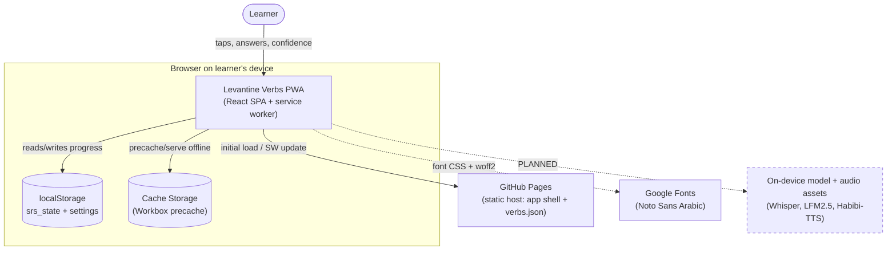
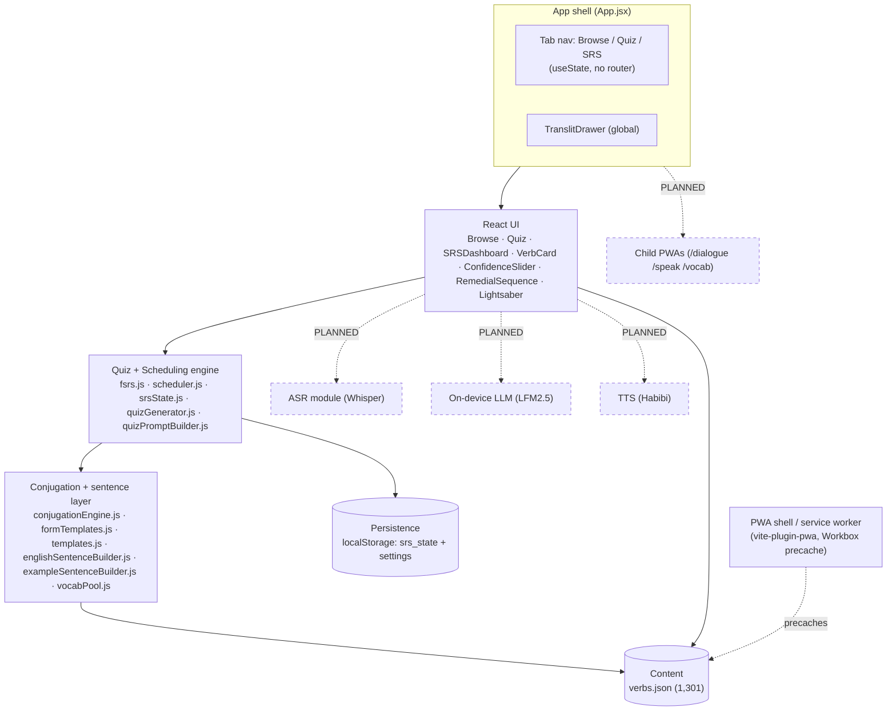
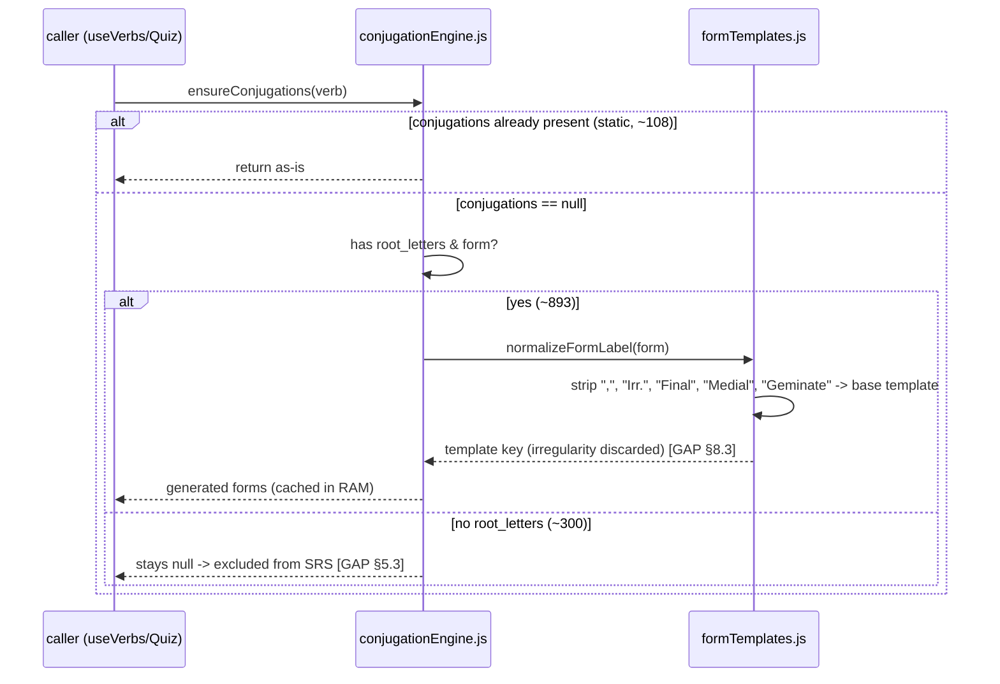

# Levantine Verbs — Software Architecture Document (SAD)

> Status: DRAFT — completed against repo ground truth, pending owner review of the [ASSUMPTION]s and [GAP]s in the Reconciliation Report.
> Baseline documented: **Deployed PWA** — static client-side app on GitHub Pages, single-device, offline-capable. Server-dependent features (ASR fine-tuning, backend TTS, on-device LLM packaging) are **horizon / planned** and recorded as deltas in §7.3.
> Owner: Stephen (repo owner / sole developer)
> Last reconciled against repo: 2026-06-23 @ commit `b227d0a` on branch `main` (inventoried via worktree branch `claude/crazy-gates-d40230`, whose tree is identical to `main` at `b227d0a`).

---

## Conventions (do not delete)

Every architectural claim carries an evidence tag:

- `[IMPLEMENTED: path]` — verified present in the named source file(s).
- `[PLANNED: spec]` — intended, sourced from a named spec/handover; **not** yet in code.
- `[ASSUMPTION]` — inferred from context; requires human confirmation.
- `[GAP]` — unknown / unresolved; flagged for the owner.

Untagged factual claims are not permitted. Marketing language is not permitted.

**Out of scope for this document:** The ALPS 1,261-verb dictionary is a *content source*, not built data — do not document it as shipped unless verbs derived from it are present in `verbs.json`.

> **Reconciliation note on the line above (raised, not silently resolved):** As of `b227d0a`, `verbs.json` contains **1,301 verb entries** [IMPLEMENTED: pwa/public/verbs.json — `node` count]. The expansion has therefore already landed: by this document's own rule ("only verbs actually present in verbs.json are built"), the ALPS-derived verbs *are* now baseline content and are documented as such throughout. The skeleton's framing of a "~103-verb baseline" with ALPS as a future source is **superseded** — see Reconciliation Report §R.4. Caveat: 1,301 *entries present* ≠ 1,301 *fully usable* — only ~1,001 are SRS-eligible and ~131 of those are quality-risky (see §5.3, §8.3).

---

## 1. Introduction and Goals

Levantine Verbs ("Conjugate This, Conjugate That") is an offline-first Progressive Web App for learning Beirut-dialect Levantine Arabic verb conjugation through interleaved, FSRS-scheduled retrieval practice. It is a **single-device, browser-based, zero-backend** app: all content ships as a static `verbs.json` asset and all learner progress lives in the device's `localStorage` [IMPLEMENTED: pwa/src/hooks/useVerbs.js:9; pwa/src/utils/srsState.js:7]. Current scope: a Browse catalogue, a Quiz surface (SRS mode + a separate free-practice mode), and an SRS progress dashboard, over **1,301 verb entries** [IMPLEMENTED: pwa/src/App.jsx:9-13, 29-33; pwa/public/verbs.json]. The horizon — a PWA hub with child apps (dialogue, speaking, vocab), on-device speech (ASR/TTS) and on-device LLM assistance — is **not built** and is recorded only in §7.2/§7.3 [PLANNED: key_next_steps_15_march_2026.md §4; LevantineVerbs_SAD_SKELETON.md §7.2].

### 1.1 Primary architectural goals

Ranked by how much they actually shaped the code that exists:

1. **Offline-first / zero-backend.** Works on a phone with no server: content precached by a service worker, progress in `localStorage`; the only runtime fetch is the local `verbs.json` [IMPLEMENTED: pwa/vite.config.js:13-30; pwa/src/hooks/useVerbs.js:9]. This is the dominant constraint — it rules out accounts, sync, and server compute.
2. **Pedagogical integrity.** FSRS v5 (DSR) scheduling, a confidence×correctness grading matrix with a "confident-error" remedial path, and interleaving with user-controlled depth [IMPLEMENTED: pwa/src/utils/fsrs.js:11-38, 176-239; pwa/src/utils/scheduler.js:21-145]. Grounded in desirable-difficulties theory [PLANNED/reference: "Making Things Hard on Yourself" (Bjork & Bjork 2011) PDF in repo].
3. **Conservative content correctness.** A tiered conjugation engine was *intended* to generate only safe/moderate forms at runtime and hold risky (irregular) verbs for native-speaker-signed static tables [PLANNED: LevantineVerbs_SAD_SKELETON.md §4, §8.3]. **This goal is only partially realized — see the [GAP] in §8.3.**
4. **Mobile-primary performance.** Portrait, standalone PWA, dark theme, touch-gesture reference drawer; target device class ≈ Galaxy S22 [IMPLEMENTED: pwa/vite.config.js:15-27; pwa/src/components/TranslitDrawer.jsx:144-153] [ASSUMPTION: specific S22/Snapdragon budget is a stated target, not evidenced in code].
5. **Extensibility toward a hub + child apps.** A future shared-origin hub with child PWAs [PLANNED: LevantineVerbs_SAD_SKELETON.md §7.2]. No code yet supports it; routing is a single in-memory tab switch (§5.2).

### 1.2 Stakeholders

| Stakeholder | Concern | What this SAD must give them |
|---|---|---|
| The learner (single primary user) | Correct conjugations, effective scheduling, works offline on a phone | An honest map of what is reliable (engine-generated regular verbs, FSRS scheduling) vs. risky (irregular runtime generation) |
| Developer / owner (Stephen) | Where the code is, what's real vs. planned, what's broken | Evidenced module map, delta table, defect register |
| Native-speaker consultant | Which forms need linguistic sign-off | The set of runtime-generated risky verbs that currently bypass sign-off (§8.3 [GAP]) |
| Claude Code (delegated executor) | A ground-truth baseline to build the next increment against | Tagged claims with file:line, and a PRD-ready inventory |

---

## 2. Architecture Constraints

### 2.1 Technical constraints

- **Static hosting only (GitHub Pages).** No server-side compute, no secrets store, no database. Forces client-only persistence and a fixed base path [IMPLEMENTED: pwa/vite.config.js:6 `base: '/levantine_verbs/'`; pwa/vite.config.js:7-9 `outDir: '../docs'`].
- **Stack lock: React 19 + Vite 7 + vite-plugin-pwa.** No CSS framework (hand-written `App.css`/`index.css`); `react-router-dom` is declared but **unused** [IMPLEMENTED: pwa/package.json:13-16, 27; pwa/src/App.css] [GAP: react-router-dom@7.13.1 declared at pwa/package.json:15 but zero imports in pwa/src].
- **Client-only persistence.** `localStorage` only; no IndexedDB in application code (the only Cache Storage / IDB usage is Workbox's framework-managed asset cache) [IMPLEMENTED: pwa/src/utils/srsState.js:7,13-44; pwa/src/pages/Quiz.jsx:96-128] [IMPLEMENTED: pwa/vite.config.js:28-30].
- **Content served as a static asset.** `verbs.json` fetched once at load via `import.meta.env.BASE_URL` and precached by the service worker [IMPLEMENTED: pwa/src/hooks/useVerbs.js:9; pwa/vite.config.js:29].
- **Manual build + deploy.** `docs/` is a **checked-in build artifact**; there is no CI [IMPLEMENTED: pwa/vite.config.js:7-9; git-tracked docs/*] [GAP: no `.github/` workflow exists — deploy is `npm run build` + manual commit of `docs/`].
- **Mobile target footprint** (≈160 MB on-device AI budget) [PLANNED/ASSUMPTION: stated in skeleton §2.1; no code consumes it].

### 2.2 Linguistic / content constraints

- **Beirut dialect** as the standard variety [ASSUMPTION: project-wide; data authored accordingly].
- **Transliteration system is the canonical display layer**: Arabizi consonants (`2 7 3`, digraphs `kh sh gh`, uppercase emphatics `S T D Z`), macron long vowels (`ā ē ī ō ū`), acute stressed shorts (`á í ú`), tilde nasals (`ã õ`). It is a **data-authoring convention**, not a transform function — there is no encoder; every `translit` string is pre-written in the scheme and surfaced as-is [IMPLEMENTED: pwa/src/components/TranslitDrawer.jsx:14-44; pwa/src/utils/vocabPool.js:15-189; transliteration_guide.md]. Consequence: data-quality depends on hand-authoring discipline; non-scheme artifacts exist (e.g. `bakh (bitbikhkh)*`, verb id 127) [GAP: no validator].
- **Native-speaker sign-off required for risky-verb conjugations** [PLANNED: skeleton §2.2, §8.3]. **Not enforced** in code — risky verbs are generated unsigned (§8.3 [GAP]).
- **Carried-forward dialect invariants** (h-dropping on possessive suffixes, vowel compression, "joum3a" for week, Friday feminine, telefōn, `3al-madrase` vs `b-il-madrase`) [PLANNED/ASSUMPTION: skeleton §2.2] — partially embodied in `vocabPool.js` literals; no systematic check [GAP].

---

## 3. Context and Scope

### 3.1 System context



Actors/dependencies: the learner; GitHub Pages (host); browser storage; Google Fonts (the one non-self-hosted asset) [IMPLEMENTED: pwa/index.html:9-11]; and (PLANNED) on-device model/audio assets [PLANNED: skeleton §3.1].

### 3.2 Technical context

- **Self-contained at runtime.** Exactly one app-issued network call: `fetch(BASE_URL + 'verbs.json')` [IMPLEMENTED: pwa/src/hooks/useVerbs.js:9]. No API, WebSocket, auth, or remote persistence anywhere in `pwa/src` (verified by grep) [IMPLEMENTED: grep `fetch|axios|XMLHttpRequest` over pwa/src → single hit]. The only other external origin is Google Fonts via `<link>` [IMPLEMENTED: pwa/index.html:9-11].
- **PWA boundary.** Service worker + web manifest are produced by `vite-plugin-pwa` with `registerType: 'autoUpdate'`; SPA navigation fallback to `index.html` [IMPLEMENTED: pwa/vite.config.js:14-30; docs/sw.js].
- **Base-path coupling.** All asset/URL resolution depends on `base: '/levantine_verbs/'`; serving from any other path breaks the SW scope and asset URLs [IMPLEMENTED: pwa/vite.config.js:6; docs/registerSW.js].
- **(PLANNED) cross-app shared origin** for a hub + child PWAs — no routing/data-sharing decision is in code [GAP: hub routing model unresolved].

---

## 4. Solution Strategy

Load-bearing decisions (detailed ADRs in §9):

- **Zero-backend offline PWA.** Data local, no auth, no sync — chosen to ship a phone-usable app from a static host [IMPLEMENTED: pwa/vite.config.js; pwa/src/utils/srsState.js].
- **FSRS v5 (DSR) over SM-2.** Full 19-weight model with a custom confidence×correctness rating fusion and a confident-error penalty path [IMPLEMENTED: pwa/src/utils/fsrs.js:11-28, 176-239].
- **Interleaving with user-controlled depth.** A scoring selector (due → new → not-due) plus a caller-side "questions per verb" cap that forces tense variety within a verb streak [IMPLEMENTED: pwa/src/utils/scheduler.js:21-145; pwa/src/pages/Quiz.jsx:285-332]. Correctness not test-verified (§5.2 [GAP]).
- **Tiered conjugation engine — runtime generation for regular forms, static tables for irregular.** *Intended* conservative failure mode; **as built, the runtime generator also processes irregular verbs** (§8.3 [GAP]) [IMPLEMENTED: pwa/src/utils/conjugationEngine.js:42-56; pwa/src/utils/formTemplates.js:276-292].
- **Sentence assembly via `quiz_objects` + builders, not stored frames.** The "Option C frame" data model (`frame_before`/`frame_after`) is **not** in the data or code; sentences are synthesized from time-adverb pools + per-verb `quiz_objects`, with particles (`ra7`/`bedde`/`lēzim`) inserted by the engine [IMPLEMENTED: pwa/src/utils/quizPromptBuilder.js:22-81] [GAP: Option C spec unimplemented; `3am` particle absent].
- **(PLANNED)** shared-origin hub over monolith; binary-match ASR over open transcription; on-device AI over cloud [PLANNED: skeleton §4, §9].

---

## 5. Building Block View

### 5.1 Level 1 — System decomposition



### 5.2 Level 2 — Frontend modules

| Module | Responsibility | Source | Status |
|---|---|---|---|
| App shell / routing | Header, **in-memory tab switch** (browse/quiz/srs), global drawer, single `useVerbs()` load | pwa/src/App.jsx:9-50 | [IMPLEMENTED] — no router; refresh always returns to `browse`; no deep-link/back-button [GAP] |
| Content loader | `fetch` verbs.json, normalize, eagerly call `ensureConjugations` on every verb | pwa/src/hooks/useVerbs.js:4-24 | [IMPLEMENTED] |
| Quiz surface | SRS mode + free-practice mode; option build, submit, feedback, remedial trigger, depth slider | pwa/src/pages/Quiz.jsx | [IMPLEMENTED] |
| FSRS engine | DSR memory model, 19 weights, confidence×correctness fusion, confident-error penalty (S×0.25, D×1.5), mastery/due math | pwa/src/utils/fsrs.js:11-274 | [IMPLEMENTED] |
| Scheduler / interleaving selector | `getNextSRSItem` scoring + tense/verb exclusion; tier gating | pwa/src/utils/scheduler.js:21-176 | [IMPLEMENTED] — **behavioural correctness not verifiable [GAP]**: stateless re: session counts, pervasive `Math.random()` (lines 79,111,117,125,133), soft depth cap (retry drops exclusions, 138-141), no tests |
| SRS state store | load/save per-verb cards, tier mastery/unlock, dashboard stats | pwa/src/utils/srsState.js:13-136 | [IMPLEMENTED] — note duplicate stats logic vs SRSDashboard.jsx (§5.5 [GAP]) |
| Quiz prompt builder (SRS) | Assemble fill-in prompt; engine-insert `ra7`/`bedde`/`lēzim` | pwa/src/utils/quizPromptBuilder.js:22-81 | [IMPLEMENTED] — `3am` never produced [GAP] |
| Free-practice generator | Standalone multiple-choice, **no FSRS**, hardcoded `VERB_TEMPLATES` | pwa/src/utils/quizGenerator.js:18-200; pwa/src/utils/templates.js | [IMPLEMENTED] — legacy path; residual object/grammar defects (§5 defects) |
| Conjugation engine | Runtime-generate forms from `root_letters`+`form`; RAM cache | pwa/src/utils/conjugationEngine.js:8-56 | [IMPLEMENTED] — gate is only `conjugations===null` |
| Form templates | Measure paradigms (Safe/Moderate) + `normalizeFormLabel` | pwa/src/utils/formTemplates.js:10-292 | [IMPLEMENTED] — **strips irregular qualifiers → generates risky forms [GAP], §8.3** |
| English sentence builder (SRS) | Grammatical English gloss (past/3s/adverb-fronting) from `english_forms` | pwa/src/utils/englishSentenceBuilder.js:41-119 | [IMPLEMENTED-with-defect] — `ni7na`/`nihna` reflexive key bug (line 35) |
| Example sentence builder (free-practice) | English gloss for free-practice | pwa/src/utils/exampleSentenceBuilder.js:19-60 | [IMPLEMENTED-with-defect] — uninflected base verb → "I study yesterday"; no adverb fronting |
| ConfidenceSlider | 4-button Again/Hard/Good/Easy (values 1-4) | pwa/src/components/ConfidenceSlider.jsx:3-27 | [IMPLEMENTED] |
| RemedialSequence | Confident-error correction screen + 3s lockout + 2-3 follow-ups | pwa/src/components/RemedialSequence.jsx:15-191 | [IMPLEMENTED] — follow-ups **don't update FSRS** [GAP, lines 74-79] |
| VerbCard / Browse | Filterable catalogue + expandable conjugation tables | pwa/src/pages/Browse.jsx:7-83; pwa/src/components/VerbCard.jsx:4-96 | [IMPLEMENTED] |
| TranslitDrawer (+QuickReference) | Swipe-in reference: translit guide + vocab pool | pwa/src/components/TranslitDrawer.jsx:69-307; QuickReference.jsx:78-160 | [IMPLEMENTED] |
| Lightsaber | Gamified progress meter (Quiz only) | pwa/src/components/Lightsaber.jsx:1-19 | [IMPLEMENTED] |

**Carried-forward defects, located (the five named in the prompt):**

1. **Transitive object pull-through** — *largely fixed* on the SRS path: objects come from `verb.quiz_objects` only for `transitivity ∈ {tr, both}` as a fresh local per call, with React state reset between questions [IMPLEMENTED: pwa/src/utils/quizPromptBuilder.js:26-29; pwa/src/pages/Quiz.jsx:329,363]. **Residual** on the free-practice path: `templates.js` `VERB_TEMPLATES` bake objects into per-verb strings and fall back to `GENERIC_TEMPLATES` when a verb has no entry, losing object agreement [IMPLEMENTED-with-defect: pwa/src/utils/templates.js:1-113; pwa/src/utils/quizGenerator.js:169-200].
2. **`englishSentenceBuilder` person vs pronoun** — *original bug fixed*: it now uses `parts.person` with an explicit warning never to use `parts.pronoun`/`parts.particle` [IMPLEMENTED: pwa/src/utils/englishSentenceBuilder.js:77-88]. **Residual**: `REFLEXIVE_PRONOUNS` keys 1st-plural as `ni7na` while the canonical key is `nihna`, so reflexive "we" falls through to `'themselves'` → "We bathed themselves" (4 reflexive verbs) [IMPLEMENTED-with-defect: pwa/src/utils/englishSentenceBuilder.js:29-38, 102].
3. **Past-tense / adverb grammar** — *fixed on SRS path* (uses `english_forms.past`, `present_3s`, and fronts frequency adverbs) [IMPLEMENTED: pwa/src/utils/englishSentenceBuilder.js:111-119]. **Still present on free-practice path**: `exampleSentenceBuilder` emits the uninflected base ("I study yesterday", "He eat yesterday") and appends adverbs ("I study always") [IMPLEMENTED-with-defect: pwa/src/utils/exampleSentenceBuilder.js:33-58].
4. **2-3 verb topic mismatches** — found 4 concrete cases (§5.3).
5. **Interleaving not fully verified** — confirmed [GAP] (this table, Scheduler row).

### 5.3 Level 2 — Data model

`verbs.json` is a **top-level JSON array of 1,301 verb objects** [IMPLEMENTED: pwa/public/verbs.json]. Two content tiers coexist:

- **Rich verbs (~103-108):** full static `conjugations` plus `classification`, `negation`, `bedde`, `active_participle`, `notes`, `examples` [IMPLEMENTED: ~103 each; `conjugations` object present in 108].
- **Skeletal verbs (~1,193):** `conjugations: null`, relying on the runtime engine.

**Top-level fields (union, % presence):** `id` 100%, `verb{arabic,translit,english}` 100%, `conjugations` 100% (but `null` in 91.7%), `difficulty` 100%, `english_forms{base,past,present_3s}` 100% (`reflexive` only 4), `form` 92.1%, `citation{past,present}` 89.1%, `root_letters` 68.7%, `transitivity` 11.7% (tr 83 / intr 59 / both 10), `topic` 8.6%, `classification`/`negation`/`bedde`/`active_participle`/`notes`/`examples` ~7.9%, `partial` 7.1%, `quiz_objects` 7.1% (92 verbs), `essential` 1.5% (20 verbs) [IMPLEMENTED: derived via `node` key-union scan].

**Conjugation sub-structure:** four tenses — `perfect` (Past), `imperfect` (Subjunctive/Base, "used with particles"), `bi_imperfect` (Habitual Present), `imperative` (Command). Each = `{label, usage, forms[]}`; each `forms[]` element = `{person, arabic, translit, english}`. Person is a flat key; canonical set = `ana, nihna, inta, inti, intu, huwwe, hiyye, hinne` [IMPLEMENTED: pwa/src/utils/constants.js:1, 13].

- **[GAP] Inconsistent person keys** in the 108 static verbs: forms mix accented translit (`ínta`, `húwwi`, `híyyi`, `ní7na`…) with bare keys (`inta`, `huwwe`…). The engine emits only bare keys, and all lookups match bare keys (`forms.find(f => f.person === person)`), so accented-key forms can silently fail to match [IMPLEMENTED: pwa/src/pages/Quiz.jsx:156,183; pwa/src/utils/conjugationEngine.js:27].

**Examples:** 494 across 103 verbs, `{arabic, translit, english, tense?}`. Transliteration is present 100% — under the key **`translit`**, *not* a separate `arabizi` field (0/494) [IMPLEMENTED: derived]. `tense` is free-text and only on 20/494 [ASSUMPTION: minor data-quality].

**Frame fields:** `frame_before`/`frame_after` **do not exist (0/1,301)** [IMPLEMENTED: derived]. The Option C frame model is realized instead via `quiz_objects` + builders (or is unbuilt) [GAP/PLANNED: quiz_frames_option_c_*.md].

**Difficulty distribution:** A 110, B 134, BA 9, C 251, D 442, E 350; plus **5 anomalous compound tiers** CB/DA/DC/EB/EC (1 each) [IMPLEMENTED: derived]. Only `BA` is handled (→ B) in gating; the other 5 are unmapped and effectively drop out of tier unlocking [GAP: pwa/src/utils/srsState.js:57; pwa/src/utils/scheduler.js:39,53].

**Topic:** 112 verbs over 8 topics (`movement` 22, `daily_routine` 16, `wants_feelings` 15, `communication` 14, `social` 13, `actions` 12, `home_life` 12, `shopping` 8) [IMPLEMENTED: derived; pwa/src/utils/constants.js:22-31]. **Mismatches (carried-forward defect #4):** id 73 `2idir` "to be able to" → `shopping` (highest-confidence error); id 30 `khálla` "to let" → `home_life`; id 105 `2assar` "affect; influence" → `social` (also tagged `transitivity:"intr"` despite a transitive gloss); id 652 `sa7ab` "withdraw" → `shopping` [IMPLEMENTED: derived spot-check].

**Coverage gap:** 300 verbs have `conjugations:null` **and no `root_letters`**, so the engine can never fill them and the scheduler (which filters `conjugations !== null`) silently excludes them — including **18 Tier-A and 27 Tier-B** verbs [GAP: pwa/src/utils/conjugationEngine.js:43; pwa/src/utils/scheduler.js:40]. Net SRS-eligible ≈ **1,001** of 1,301.

**Runtime state (the canonical progress record):** `localStorage['srs_state']` = JSON map `verb_id → card`, where card = `{verb_id, D(1-10), S(days), last_review(ISO date|null), reps, lapses, confident_errors, state('new'|'learning'|'review'|'relearning')}` [IMPLEMENTED: pwa/src/utils/fsrs.js:263-274; pwa/src/utils/srsState.js:32-44]. **Scheduling unit is the verb, not the verb+tense** (§6, §8.2) [IMPLEMENTED: pwa/src/utils/srsState.js:40-44]. No review-history journal is persisted [GAP].

### 5.4 Level 2 — Learning apps / activities inventory

| Activity | Status | "Route" | Data touched | Source/spec |
|---|---|---|---|---|
| Browse catalogue | [IMPLEMENTED] | tab `browse` | verbs.json (read) | pwa/src/pages/Browse.jsx |
| SRS conjugation quiz | [IMPLEMENTED] | tab `quiz` (SRS mode) | verbs.json + `srs_state` | pwa/src/pages/Quiz.jsx; fsrs/scheduler |
| Free-practice quiz | [IMPLEMENTED] | tab `quiz` (free mode) | verbs.json only (no FSRS) | pwa/src/utils/quizGenerator.js |
| SRS dashboard | [IMPLEMENTED] | tab `srs` | `srs_state` (read) | pwa/src/pages/SRSDashboard.jsx |
| Dialogue reader | [PLANNED] | `/dialogue` | — | key_next_steps §4 |
| Speaking + ASR binary-match | [PLANNED] | `/speak` | — | skeleton §5.4, §8.4 |
| Vocab app | [PLANNED] | `/vocab` | — | skeleton §5.4 |
| Hub at app root + child PWAs | [PLANNED] | `/` | shared origin | skeleton §7.2 |

There is **no hub and no child apps**; the three activities are tabs in one SPA [IMPLEMENTED: pwa/src/App.jsx:29-33].

### 5.5 Progress & dashboards

Current dashboard shows **Due today**, **Reviewed**, per-tier mastery progress bars (A-E, locked/unlocked), and a **Trouble Verbs** list (`confident_errors >= 2`) [IMPLEMENTED: pwa/src/pages/SRSDashboard.jsx:9-91]. The planned expanded dashboard (topic radar, four-skills tracking, tier heat map) is [PLANNED: skeleton §5.5].

- **[GAP] Duplicated, divergent stats logic:** `srsState.getDashboardStats` (skips `state==='new'`) and an inline reimplementation in `SRSDashboard.jsx` (skips `reps===0`) compute "reviewed" by different predicates [IMPLEMENTED: pwa/src/utils/srsState.js:103-136 vs pwa/src/pages/SRSDashboard.jsx:10-35].

---

## 6. Runtime View

**(a) SRS attempt → grade → FSRS update → persist** [IMPLEMENTED: pwa/src/pages/Quiz.jsx:236-282; pwa/src/utils/fsrs.js:199-239; pwa/src/utils/srsState.js:40-44]:

```mermaid
sequenceDiagram
    actor U as Learner
    participant Q as Quiz.jsx
    participant F as fsrs.js
    participant S as srsState.js
    participant LS as localStorage
    U->>Q: select option + set confidence (1-4), Submit
    Q->>Q: isCorrect = (selected === answer)
    Q->>F: mapConfidenceOutcome(confidence, isCorrect)
    F-->>Q: {rating, isConfidentError}
    Q->>S: getCard(verbId)
    Q->>F: updateCard(card, daysSince, confidence, isCorrect)
    alt confident error (Easy + wrong)
        F->>F: S = max(w0, S*0.25); D = harsher
    else correct
        F->>F: S = stabilityAfterRecall(...)
    else standard lapse
        F->>F: S = stabilityAfterForgetting(...)
    end
    F-->>Q: updated card
    Q->>S: saveCard(verbId, card)
    S->>LS: write srs_state (whole map)
    opt confident error
        Q->>U: RemedialSequence (3s lockout + follow-ups; NOT scheduled)
    end
```

**(b) Next-item selection → interleaving → prompt assembly** [IMPLEMENTED: pwa/src/utils/scheduler.js:21-145; pwa/src/pages/Quiz.jsx:285-332; pwa/src/utils/quizPromptBuilder.js:22-81]:

```mermaid
sequenceDiagram
    participant Q as Quiz.jsx
    participant SC as scheduler.js
    participant P as quizPromptBuilder.js
    Q->>Q: build exhaustedVerbIds (count >= maxPerVerb), recentTenses
    Q->>SC: getNextSRSItem(verbs, lastItem, {excludeVerbIds, excludeTenses})
    SC->>SC: filter to unlocked tiers & conjugations != null
    SC->>SC: score (due<0, new>0, not-due>0); sort; random tiebreak
    SC->>SC: pick first verb+tense+person (drop exclusions on retry if empty)
    SC-->>Q: {verb, tense, person}
    Q->>P: buildQuizPrompt(verb, tense, person, particle)
    P-->>Q: prompt (pronoun + ra7/bedde/lēzim + BLANK + object + timeAdverb)
    Note over SC,P: pervasive Math.random; 3am never emitted; correctness not test-verified [GAP]
```

**(c) Conjugation lookup → tier routing** [IMPLEMENTED: pwa/src/utils/conjugationEngine.js:20-56; pwa/src/utils/formTemplates.js:276-292]:



**(d) (PLANNED) speaking turn → TTS → read-aloud → Whisper binary-match** [PLANNED: skeleton §6(d), §8.4].

---

## 7. Deployment View

### 7.1 Baseline deployment

The canonical deployment is **GitHub Pages serving the committed `/docs` folder** [ASSUMPTION: classic "deploy from /docs" mode — inferred from `base` + `outDir: '../docs'` + a tracked `docs/` with no `gh-pages` branch and no Pages config file in-repo; confirm in GitHub repo settings]. Build is **manual**: `npm run build` (Vite) writes hashed JS/CSS, `sw.js`, `registerSW.js`, `workbox-*.js`, `manifest.webmanifest`, and copies `verbs.json` + icons into `docs/` [IMPLEMENTED: pwa/vite.config.js:7-9; pwa/package.json:6-11; tracked docs/*]. The service worker precaches the shell + `verbs.json` and serves an offline SPA fallback [IMPLEMENTED: docs/sw.js]. All learner state is client-side [IMPLEMENTED: pwa/src/utils/srsState.js].

### 7.2 Horizon deployment

Planned shape [PLANNED: skeleton §7.2; key_next_steps §4]: a shared-origin **hub at the app root** + child PWAs (`/conjugate/`, `/dialogue/`, `/speak/`, `/vocab/`) sharing `localStorage`; on-device model assets (Whisper.cpp WASM and/or a Capacitor native wrapper; LFM2.5 via GGUF/ONNX); audio assets (Habibi-TTS, pre-generated static or backend). A backend becomes unavoidable for **live** TTS [ASSUMPTION]. "No code change to add a child app" portability is **unevidenced** today (single SPA, no router) [GAP].

### 7.3 Current state vs target — DELTA TABLE

| Concern | Target (baseline / horizon) | Current actual | Gap / action |
|---|---|---|---|
| Deployed source | Canonical `main` | Inventoried at `b227d0a` (= `main`); work on worktree branch | None (trees identical) |
| **Verb coverage** | ~103 baseline (skeleton assumption) | **1,301 entries; ~1,001 SRS-eligible** | **Assumption superseded** — expansion landed; ~300 unreachable (no root_letters) incl. 18 A / 27 B → backfill root_letters |
| Conjugation correctness | Irregular held for static + sign-off | ~131 irregular verbs runtime-generated unsigned | Reinstate risk gate (§8.3) |
| CI / deploy | (implied automated) | No CI; manual `build` + commit `docs/` | `docs/` can drift; add a build check or Action |
| ASR (speaking) | Whisper binary-match | Not wired (no code) | [PLANNED] |
| On-device LLM | LFM2.5 distractors/feedback | Not packaged | [PLANNED] |
| TTS | Habibi-TTS audio | None | [PLANNED] |
| Hub + child apps | Shared-origin hub | Single SPA, in-memory tabs, router unused | [PLANNED]; routing decision open |
| Frames | Option C `frame_before/after` | Fields absent; quiz_objects + builders | Decide: adopt frame data or formalize builder model |
| Known defects | (none) | 5 carried-forward + bonus gaps (§11) | See defect register |
| Telemetry | (unspecified) | None | Decide if any offline-safe metric is wanted |

This is the living section — regenerate at each increment.

---

## 8. Cross-cutting Concepts

### 8.1 Persistence & data lifecycle

`localStorage` is the only application persistence. Canonical progress = `srs_state` (per-verb FSRS cards) [IMPLEMENTED: pwa/src/utils/srsState.js:7,13-44]. Settings keys: `srs_mode`, `quiz_persons`, `srs_verb_range`, `srs_topic`, `srs_max_per_verb` (interleaving depth) [IMPLEMENTED: pwa/src/pages/Quiz.jsx:96-128]. `loadAllCards` re-parses on every call with a try/catch → `{}` on corruption (no in-memory cache, no React context) [IMPLEMENTED: pwa/src/utils/srsState.js:13-20]. Session interleaving state (`verbSessionCounts`, `recentTensesForVerb`) is React `useState` only and lost on reload [IMPLEMENTED: pwa/src/pages/Quiz.jsx:67-69]. **Data-loss risk:** clearing browser storage wipes all progress; there is no export/backup/sync [GAP].

### 8.2 Scheduling & pedagogy

FSRS v5 / DSR with the standard 19-weight default vector and a tunable `FSRS_CONFIG` (`requestRetention 0.9`, `masteryThreshold 21`, `tierUnlockPercent 0.70`, `confidentErrorSMultiplier 0.25`, `confidentErrorDMultiplier 1.5`, `enableFuzz`) [IMPLEMENTED: pwa/src/utils/fsrs.js:11-38]. Grading fuses a 1-4 confidence self-rating with actual correctness: correct→rating=confidence (a confident-but-correct "Again" is bumped to Hard); any wrong→Again; **confident wrong (Easy + wrong)→ `isConfidentError`** → `S = max(w0, S×0.25)`, harsher `D`, and a UI remedial sequence [IMPLEMENTED: pwa/src/utils/fsrs.js:176-188, 213-219; RemedialSequence.jsx]. Tier unlock is sequential A→E at 70% mastery of the prior tier [IMPLEMENTED: pwa/src/utils/srsState.js:74-98]. Content-island break cards are [PLANNED: skeleton §8.2 — not found in code].

- **[GAP] Verb-level (not verb+tense) granularity:** one card per verb means a correct answer in any tense raises stability for the whole verb; a learner weak in one tense can't be scheduled separately [IMPLEMENTED: pwa/src/utils/srsState.js:40-44].
- **[GAP] `w[17]`/`w[18]` (short-term steps) defined but unused** — day-granularity intervals only [IMPLEMENTED: pwa/src/utils/fsrs.js:26-27, 135-145].
- **[GAP] Remedial follow-ups never call `updateCard`/`saveCard`** — they affect only a local score display [IMPLEMENTED: pwa/src/components/RemedialSequence.jsx:74-79].

### 8.3 Content pipeline & conjugation engine

Pipeline: pipe-delimited/XLSX source → `verbs.json` (static asset) → loaded once → `ensureConjugations` fills `null`-conjugation verbs at runtime from `root_letters` + `form` via `FORM_TEMPLATES` [IMPLEMENTED: pwa/src/hooks/useVerbs.js:13-16; pwa/src/utils/conjugationEngine.js:42-56]. The transliteration system is the display layer (§2.2). Sentence assembly engine-inserts particles `ra7`/`bedde`/`lēzim` [IMPLEMENTED: pwa/src/utils/quizPromptBuilder.js:53-63].

- **[GAP] Guarded invariant breached — risky verbs generated at runtime.** There is **no risk classification field** in `verbs.json`, and the Safe/Moderate "tiers" exist only as comments [IMPLEMENTED: pwa/src/utils/formTemplates.js:10-12, 101, 217]. The only routing gate is `conjugations===null`. `normalizeFormLabel` actively **strips** `Irr.`/`Final`/`Medial`/`Geminate` qualifiers and falls back to the base mechanical (sound-root) template [IMPLEMENTED: pwa/src/utils/formTemplates.js:283-284], and maps `Emphatic`→`Quadrilateral` [line 287]. Result: of ~893 runtime-generated verbs, **~131 carry explicit irregular/weak/geminate markers that are discarded**, producing phonologically wrong forms for those verbs (e.g. `2adda` id 112, `bi2y` id 152, `ball` id 156) — generated **without** the native-speaker sign-off the design requires. Per the prompt's instruction, this contradiction is flagged, not reconciled.
- **[GAP] Option C frame rule:** the spec's `frame_before`/`frame_after` are unused/absent (§5.3). Within the builder's own model, particles are engine-inserted (rule's spirit holds), **but `3am` (progressive) is never emitted in SRS** (`tenseLabels` only yields `ra7`/`bedde`/`lēzim`), and `lēzim` is treated like `ra7` rather than as a contextual frame [IMPLEMENTED: pwa/src/utils/tenseLabels.js:1-5; pwa/src/utils/quizPromptBuilder.js:53-69].

### 8.4 Speech (ASR/TTS) — PLANNED

Whisper binary-match (match against two known strings, not open transcription); Arabic-script training, Arabizi only at display; whisper.cpp WASM/native; Habibi-TTS audio. **All [PLANNED: skeleton §8.4; key_next_steps §4]** — no code present.

### 8.5 On-device AI — PLANNED

LFM2.5-350M for distractor generation / feedback / classification; GGUF/ONNX + Capacitor packaging; ~160 MB budget. **All [PLANNED: skeleton §8.5]** — no code present.

### 8.6 PWA shell, build & observability

`vite-plugin-pwa` (`registerType: 'autoUpdate'`), inline manifest (name "Levantine Verbs", standalone, portrait, theme `#1a1a2e`, two SVG icons), Workbox precache glob `**/*.{js,css,html,json,png,svg}`, SPA navigation fallback, base path `/levantine_verbs/` [IMPLEMENTED: pwa/vite.config.js:14-30; docs/sw.js; docs/registerSW.js]. No custom `runtimeCaching`; no PWA in dev mode [IMPLEMENTED: pwa/vite.config.js:28-30].

- **[GAP] No observability whatsoever:** zero `console.*`, no analytics/Sentry/telemetry across `pwa/src`; the `verbs.json` fetch error is swallowed silently [IMPLEMENTED: pwa/src/hooks/useVerbs.js:20].
- **[GAP] No tests and no CI:** no test framework in `package.json`, no `.github/` workflows. All correctness is by inspection.

---

## 9. Architecture Decisions

| ID | Decision | Status | Rationale | Source |
|---|---|---|---|---|
| ADR-1 | Offline / zero-backend single-device PWA | ACCEPTED | Phone-usable from a static host; no auth/sync to build | pwa/vite.config.js; srsState.js |
| ADR-2 | FSRS v5 (DSR) over SM-2 | ACCEPTED | Modern memory model; finer stability control | fsrs.js:11-28 |
| ADR-3 | Confidence×correctness grading + confident-error penalty | ACCEPTED | Desirable-difficulties; punish overconfidence | fsrs.js:176-219 |
| ADR-4 | Interleaving with user-controlled depth | ACCEPTED (unverified) | Interleaving > blocking for retention | scheduler.js; Quiz.jsx:285-332 |
| ADR-5 | Tiered conjugation engine, conservative failure (risky→static+sign-off) | **PARTIALLY VIOLATED** | Avoid shipping wrong irregular forms | formTemplates.js:276-292 — see §8.3 [GAP] |
| ADR-6 | Sentence frames: builder + quiz_objects rather than stored Option C frames | ACCEPTED (implicit) | Pragmatic; avoids per-verb frame authoring | quizPromptBuilder.js — diverges from spec |
| ADR-7 | `docs/` checked-in build, manual deploy | ACCEPTED | Simplest GitHub Pages path | vite.config.js:7-9 |
| ADR-8 | Verb-level scheduling unit | ACCEPTED (implicit) | Simpler card model | srsState.js:40-44 — see §8.2 [GAP] |
| ADR-9 | (PLANNED) shared-origin hub over monolith | OPEN | Extensibility | skeleton §7.2 [GAP routing] |
| ADR-10 | (PLANNED) binary-match ASR over open transcription | OPEN | Robust, on-device | skeleton §8.4 |
| ADR-11 | (PLANNED) on-device LFM2.5 over cloud / Gemma | OPEN | Offline + footprint | skeleton §8.5 |

---

## 10. Quality Requirements

| Quality | Scenario (stimulus → response → measure) | Status |
|---|---|---|
| Offline availability | Airplane mode → app loads, quiz runs, progress saves → 100% of core flows work with no network | [IMPLEMENTED] by design (SW precache + localStorage); **unmeasured [GAP]** |
| Mobile performance | Cold load on a mid-range phone → interactive → target load/interaction budget | [GAP] no budget evidenced or measured |
| Content correctness | Any quizzed form → matches native-speaker-correct dialect form → sign-off gate | **[GAP]** — ~131 irregular verbs generated unsigned (§8.3) |
| Extensibility | Add a child app → existing apps unchanged → no regression | [GAP] not achievable today (single SPA, no router) |
| On-device AI footprint | Bundle + models → ≤ ~160 MB on device | [PLANNED/GAP] no code |
| Data durability | (no requirement stated) → progress survives → backup/export | [GAP] none; storage-clear = total loss |

### 11. Risks and Technical Debt

| Risk / debt | Severity | Mitigation |
|---|---|---|
| Irregular verbs generated unsigned (§8.3) — wrong forms taught | **High** | Add risk field / honor irregular markers; route to static tables + sign-off |
| ~300 verbs (incl. 18 A, 27 B) unreachable in SRS — no `root_letters` | High | Backfill `root_letters` or static conjugations |
| Browser-storage data loss; single-device only (no sync/backup) | High | Export/import; optional cloud sync (breaks zero-backend) |
| Interleaving correctness unverified; non-deterministic; no tests | Medium | Inject RNG seam; add deterministic scheduler/FSRS tests |
| `docs/` drift from `pwa/` (manual build, no CI) | Medium | CI build + artifact check |
| Free-practice path defects (object pull-through, ungrammatical English) | Medium | Migrate free-practice to `english_forms` + quiz_objects, or retire it |
| Reflexive `ni7na`/`nihna` key bug; inconsistent static person keys | Medium | Normalize person keys data-wide; fix `REFLEXIVE_PRONOUNS` |
| 5 unmapped compound difficulty tiers drop verbs from gating | Low | Normalize to A-E |
| Topic mis-assignments (2idir→shopping, etc.) | Low | Content review of 112 tagged verbs |
| `3am` progressive unreachable in SRS; verb-level granularity | Low-Med | Add `3am` to particle pool; consider per-tense cards |
| Remedial follow-ups don't feed FSRS; duplicate dashboard stats; unused `react-router-dom`; `w[17]/w[18]` dead | Low | Wire follow-ups or document intent; dedupe; drop dep |
| No observability — silent failures | Low | Optional offline-safe error surfacing |
| Planned-feature footprint (Whisper + LFM2.5 on 8 GB) | Med (future) | Validate footprint before committing |

## 12. Glossary

- **FSRS** — Free Spaced Repetition Scheduler; modern SRS algorithm (here v5).
- **DSR** — Difficulty / Stability / Retrievability, FSRS's memory-state triple.
- **SM-2** — the classic SuperMemo-2 algorithm FSRS replaces.
- **Stability (S)** — days until retrievability decays to the retention target; mastery at S≥21.
- **Retrievability (R)** — modeled probability of recall now, given S and elapsed time.
- **Interleaving** — mixing verbs/tenses rather than blocking one verb; depth = "questions per verb."
- **Desirable difficulties** — Bjork's principle that effortful retrieval aids long-term retention.
- **Content island** — non-assessed break card between review batches [PLANNED].
- **Option C frame** — a per-verb/per-tense sentence-scaffold model (`frame_before`/`frame_after`); not implemented as data.
- **Tiered conjugation engine** — runtime generation for regular forms, static tables for irregular (intended; partially breached).
- **Arabizi / transliteration system** — chat-alphabet Latin encoding (2 7 3, kh sh gh, emphatic caps, macron/acute/tilde vowels) used as the display layer.
- **Confident error** — a high-confidence ("Easy") wrong answer; triggers an S×0.25 penalty + remedial sequence.
- **Card** — one FSRS scheduling record; here keyed per **verb** (not per verb+tense).
- **Binary-match ASR** — match speech against two known strings rather than open transcription [PLANNED].
- **PWA / service worker** — installable web app + the worker that precaches assets for offline use.
- **Aldrich core** — the ~103 hand-authored verbs from Matthew Aldrich's *Levantine Arabic Verbs*.
- **ALPS** — the Spoken Levantine Arabic Verbs Dictionary; source of the verb expansion (now in `verbs.json`).

---

## Reconciliation Report

### R.1 [GAP]s by section

- **§2.1 / §5.2:** `react-router-dom` declared but unused; no router → no deep-linking, refresh resets to `browse`.
- **§5.2 (Scheduler):** interleaving behaviour not verifiable from code — stateless selector + pervasive `Math.random()` + soft depth cap + **no tests**.
- **§5.3:** inconsistent `person` keys (accented vs bare) in 108 static verbs; `frame_before/after` absent; 5 unmapped compound difficulty tiers; 300 verbs (incl. 18 A / 27 B) unreachable in SRS for lack of `root_letters`; no `arabizi` field (transliteration lives under `translit`); no review-history journal.
- **§5.5:** duplicated, divergent dashboard stats logic.
- **§8.2:** verb-level (not verb+tense) scheduling; `w[17]/w[18]` dead; remedial follow-ups don't update FSRS.
- **§8.3:** **guarded-invariant breach** — irregular verbs runtime-generated unsigned; `3am` unreachable in SRS; Option C frames unimplemented.
- **§8.6 / §10:** no tests, no CI, no observability; performance/footprint/durability requirements unmeasured.
- **§7.1:** GitHub Pages "deploy from /docs" mode inferred, not confirmed in-repo.

### R.2 [ASSUMPTION]s the owner must confirm

1. Deployment is GitHub Pages serving `/docs` on `main` (confirm in repo settings).
2. Per-verb (not per-tense) scheduling is deliberate.
3. Day-granularity scheduling is intended (hence `w[17]/w[18]` unused).
4. The Galaxy-S22 / ~160 MB budgets are real targets (not evidenced in code).
5. The free-practice quiz mode is still wanted (vs. retiring it in favour of SRS).
6. Beirut dialect + the listed dialect invariants are the authoritative content standard.

### R.3 Code-vs-spec disagreements (stated, not silently reconciled)

- **Conservative-failure invariant (skeleton §4/§8.3) vs `formTemplates.normalizeFormLabel`:** spec says risky verbs use static tables + sign-off; code strips irregular qualifiers and generates them mechanically [formTemplates.js:283-287]. Flagged — not "corrected."
- **Option C frame rule (quiz_frames_option_c_*.md) vs runtime:** spec defines `frame_before/after` and engine-inserted `ra7/bedde/3am`; code has no frame fields and never emits `3am` [quizPromptBuilder.js; tenseLabels.js].
- **Skeleton "~103-verb baseline, ALPS = source not shipped" vs data:** `verbs.json` has 1,301 entries — the expansion is shipped (see R.4).

### R.4 The expansion-already-landed reconciliation (owner's flagged "aspiration already achieved")

The skeleton/prompt assume a ~103-verb baseline with ALPS as a future content source. Reality at `b227d0a`: **1,301 verb entries are present and built** (≈1,001 SRS-eligible; ≈131 quality-risky; ≈300 unreachable). This document treats 1,301 as the content baseline and recommends the PRD be written against that reality — with the three quality caveats above as explicit backlog, not as reasons to understate coverage.

### R.5 Carried-forward defects — located in code

| # | Defect | Location | State |
|---|---|---|---|
| 1 | Transitive object pull-through | quizPromptBuilder.js:26-29 (fixed path); templates.js:1-113 + quizGenerator.js:169-200 (residual, free-practice) | Partially fixed |
| 2 | English builder person/pronoun | englishSentenceBuilder.js:77-88 (fixed); :29-38,102 (`ni7na`/`nihna` reflexive residual) | Partially fixed |
| 3 | Past-tense / adverb grammar | englishSentenceBuilder.js:111-119 (fixed, SRS); exampleSentenceBuilder.js:33-58 (still broken, free-practice) | Partially fixed |
| 4 | Topic mis-assignment | verbs.json ids 73, 30, 105, 652 | Open (data) |
| 5 | Interleaving not verified | scheduler.js:21-145 + Quiz.jsx:285-332 (no tests; non-deterministic) | Open |

### R.6 Counts

- **[GAP]: 20** distinct gaps raised (R.1, plus the §8.3 invariant breach counted once).
- **[ASSUMPTION]: 6** owner confirmations needed (R.2).
- **Code-vs-spec disagreements: 3** (R.3).
- **Carried-forward defects: 5**, all located (R.5); each currently *partially fixed or open* — none fully closed.
